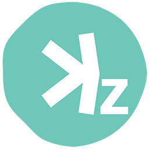

# KaspaZ (kaspaz-qt) #




## Overview ##

KaspaZ is a hobby-driven blockchain project created purely for fun, exploration, and innovation. Our mission is to blend cutting-edge blockchain technologies like zk-SNARKs with lightning-fast transaction speeds, providing an exciting platform for privacy and experimentation. KaspaZ celebrates the joy of building, learning, and pushing the boundaries of what's possible in the blockchain space—all while keeping things simple and enjoyable for the community. 

LAUNCH DATE 01.01.25

## Core Features ## 

Blockchain Base: Built on the Komodo platform as an asset chain.

Privacy: Utilizes zk-SNARKs for optional private transactions, offering users flexibility in privacy.

Block Time: 45-second block times, ensuring a balance between speed and security.

Emission Schedule:

Yearly halving cycle.

Monthly decay rate ensures smooth reward adjustments.

Mimics Kaspa’s emission curve, tailored for 45-second blocks.

Maximum Supply: Capped at 28 billion coins, ensuring long-term scarcity.

Mining Algorithm: Uses the Equihash algorithm, promoting ASIC-friendly mining and decentralization.

Transaction Efficiency: Inspired by Kaspa’s DAG-based efficiency while maintaining simplicity on the Komodo platform.

No Premine or Developer Fees: Ensures fairness and true decentralization.


KaspaZ is available on three OS platforms: `Windows`, `Linux`, and `macOS`.

Use the default `static` branch and the following scripts in `./zcutil` to build, depending on your target platform and architecture:

- **Linux**:
  - `build.sh`: Native build for Linux.
  - `build-no-qt.sh`: Native build for Linux, but without Qt (produces a daemon-only version).
  - `build-aarch64-cross.sh`: Cross-compilation for ARM (aarch64) on Linux.

- **Windows**:
  - `build-win.sh`: Cross-compilation for Windows from a Linux environment.

- **MacOS**:
  - `build-mac.sh`: Native build for macOS (x86_64). Use on Intel-based Macs or run with `arch -x86_64 /bin/zsh` on Apple Silicon Macs.
  - `build-mac-cross.sh`: Cross-compilation for macOS (x86_64) from a Linux environment; produces `Mach-O 64-bit x86_64 executable` binaries.
  - `build-mac-arm.sh`: Native build for macOS aarch64. Use this on Apple Silicon Macs to produce `Mach-O 64-bit executable arm64` binaries.
  - `build-mac-arm-cross.sh`: Cross-compilation for macOS aarch64 from a Linux environment.

Or use the `static-experimental` branch to access the latest `nightly` features.

**Note**: Cross-compiled `arm64` Darwin (macOS) binaries do not include a digital signature by default. To use these binaries on macOS, they must be [signed](https://github.com/DeckerSU/KomodoOcean/wiki/F.A.Q.#q-the-zsh-killed-message-appears-on-macos-when-running-a-aarch64-apple-darwin-cross-compiled-binary) before execution. Failure to sign these binaries may result in issues with macOS security settings, preventing them from running properly.


## How to build? ##

#### Linux

The following packages are needed:
```shell
sudo apt-get install build-essential pkg-config libc6-dev m4 g++-multilib autoconf libtool ncurses-dev unzip git python3 bison zlib1g-dev wget libcurl4-gnutls-dev bsdmainutils automake curl
```
Build:
```shell
git clone https://github.com/Kaspa-dev/KaspaZ --branch static --single-branch
cd KaspaZ
./zcutil/fetch-params.sh
# -j8 = using 8 threads for the compilation - replace 8 with number of threads you want to use
./zcutil/build-linux.sh -j8
```
This can take some time.

#### Linux (aarch64)

Install the Cross-Compilation Toolchain:

```shell
sudo apt install g++-aarch64-linux-gnu
aarch64-linux-gnu-g++ --version # verify the installation
```
Build:
```shell
./zcutil/build-aarch64-cross.sh -j8
```

#### OSX (Cross-compile)

Before start, read the following docs: [depends](https://github.com/bitcoin/bitcoin/blob/master/depends/README.md), [macdeploy](https://github.com/bitcoin/bitcoin/blob/master/contrib/macdeploy/README.md) .

Install dependencies:
```
sudo apt-get install curl librsvg2-bin libtiff-tools bsdmainutils cmake imagemagick libcap-dev libz-dev libbz2-dev python3-setuptools libtinfo5 xorriso
# sudo apt-get install libstdc++-$(g++ -dumpversion)-dev # in the event of errors occurring while building native_libtapi
```

Place prepared SDK file `Xcode-13.2.1-13C100-extracted-SDK-with-libcxx-headers.tar.gz` in repo root, use `build-mac-cross.sh` script to build.

#### OSX (Native)
Ensure you have [brew](https://brew.sh) and Command Line Tools installed.
```shell
# Install brew
/usr/bin/ruby -e "$(curl -fsSL https://raw.githubusercontent.com/Homebrew/install/master/install)"
# Install Xcode, opens a pop-up window to install CLT without installing the entire Xcode package
xcode-select --install 
# Update brew and install dependencies
brew update
brew upgrade
brew tap discoteq/discoteq; brew install flock
brew install autoconf autogen automake
brew install binutils
brew install protobuf
brew install coreutils
brew install wget
# Clone the KaspaZ repo
git clone https://github.com/Kaspa-dev/KaspaZ --branch static --single-branch
# Change master branch to other branch you wish to compile
cd KaspaZ
./zcutil/fetch-params.sh
# -j8 = using 8 threads for the compilation - replace 8 with number of threads you want to use
./zcutil/build-mac.sh -j8
```
This can take some time.

macOS 12 (Monterrey) have incompatible version of Xcode `14.2` (Build version 14C18), to build on Monterrey you'll need to install the older version `13.2.1` using the following steps:

- Download the specific Xcode 13.2.1 version from [here](https://stackoverflow.com/questions/10335747) or [here](https://developer.apple.com/services-account/download?path=/Developer_Tools/Xcode_13.2.1/Xcode_13.2.1.xip).
- [Install](https://stackoverflow.com/questions/43663097/how-to-install-xcode-from-xip-file) it.
- To set default Xcode version run this command:
```
sudo xcode-select -switch /Applications/Xcode_13.2.1.app
```
- To check default Xcode version in your system use this command:
```
xcodebuild -version
```

#### Windows (Cross-compile)
Use a debian cross-compilation setup with mingw for windows and run:
```shell
sudo apt-get install build-essential pkg-config libc6-dev m4 g++-multilib autoconf libtool ncurses-dev unzip git python python-zmq zlib1g-dev wget libcurl4-gnutls-dev bsdmainutils automake curl cmake mingw-w64
curl https://sh.rustup.rs -sSf | sh
source $HOME/.cargo/env
rustup target add x86_64-pc-windows-gnu

sudo update-alternatives --config x86_64-w64-mingw32-gcc
# (configure to use POSIX variant)
sudo update-alternatives --config x86_64-w64-mingw32-g++
# (configure to use POSIX variant)

git clone https://github.com/Kaspa-dev/KaspaZ --branch static --single-branch
cd KaspaZ
./zcutil/fetch-params.sh
# -j8 = using 8 threads for the compilation - replace 8 with number of threads you want to use
./zcutil/build-win.sh -j8
#This can take some time.
```
**kaspaz is experimental and a work-in-progress.** Use at your own risk.


## Create kaspaz.conf ##

Before start the wallet you should `kaspaz.conf` at one of the following locations:

- Linux - `~/.kaspaz/kaspaz.conf`
- Windows - `%APPDATA%\Komodo\kaspaz.conf`
- MacOS - `~/Library/Application Support/Komodo/kaspaz.conf`

With the following content:

```
txindex=1
rpcuser=kaspaz
rpcpassword=local321 # don't forget to change password
rpcallowip=127.0.0.1
rpcbind=127.0.0.1
server=1
```

Bash one-liner for Linux to create `kaspaz.conf` with random RPC password:

```
RANDPASS=$(tr -cd '[:alnum:]' < /dev/urandom | fold -w16 | head -n1) && \
tee -a ~/.kaspaz/kaspaz.conf << END
txindex=1
rpcuser=kaspaz
rpcpassword=${RANDPASS}
rpcallowip=127.0.0.1
rpcbind=127.0.0.1
server=1
END
```

## Developers of Qt wallet ##

- Main developer: **Ocean**
- IT Expert / Sysengineer: **Decker**
